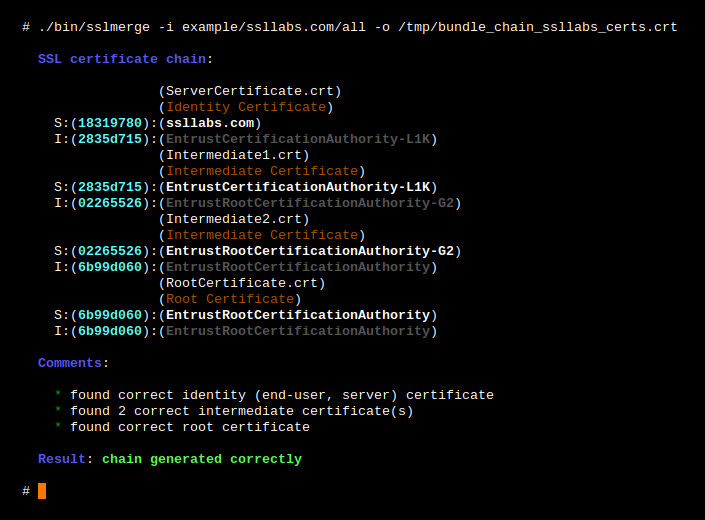
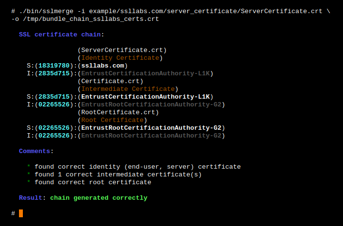

<h1 align="center">Sslmerge</h1>

<h4 align="center">Open source tool to help you build a valid SSL certificate chain.</h4>

<p align="center">
  <a href="https://img.shields.io/badge/Branch-master-green.svg">
    
  </a>
  <a href="https://img.shields.io/badge/Version-v1.4.0-lightgrey.svg">
    
  </a>
  <a href="https://travis-ci.org/trimstray/sslmerge">
    
  <a href="http://www.gnu.org/licenses/">
    
  </a>
</p>

<p align="center">
   <a href="#description">Description</a>
 • <a href="#parameters">Parameters</a>
 • <a href="#requirements">Requirements</a>
 • <a href="#how-to-use">How To Use</a>
 • <a href="#certificate-chain">Certificate Chain</a>
 • <a href="#certificate-paths">Certificate Paths</a>
 • <a href="#output-comments">Output comments</a>
 • <a href="#loggind">Logging</a>
 • <a href="#contributing">Contributing</a>
 • <a href="#project-architecture">Project Architecture</a>
 • <a href="#license">License</a>
 • <a href="https://github.com/trimstray/sslmerge/wiki">Wiki</a>
</p>

<div align="center">
  <sub>Created by
  <a href="https://twitter.com/trimstray">trimstray</a> and
  <a href="https://github.com/trimstray/sslmerge/graphs/contributors">
    contributors
  </a>
</div>

## Description

Is an open source tool to help you build a valid SSL certificate chain from the root certificate to the end-user certificate. Also can help you fix the incomplete certificate chain and download all missing CA certificates.

## Parameters

Provides the following options:

```
  Usage:
    sslmerge <option|long-option>

  Examples:
    sslmerge --in Root.crt --in Intermediate1.crt --in Server.crt --out bundle_chain_certs.crt
    sslmerge --in /tmp/certs/ --out bundle_chain_certs.crt --with-root
    sslmerge -i Server.crt -o bundle_chain_certs.crt

  Options:
        --help        show this message
        --debug       displays information on the screen (debug mode)
    -i, --in          add certificates to merge (multiple files or directory)
    -o, --out         saves the result (chain) to file
        --with-root   add root certificate to the certificate chain
```

## Requirements

**Sslmerge** uses external utilities to be installed before running:

- [openssl](https://www.openssl.org/)

## How To Use

It's simple - for install:

```
./setup.sh install
```

For remove:

```
./setup.sh uninstall
```

> - symlink to `bin/sslmerge` is placed in `/usr/local/bin`
> - man page is placed in `/usr/local/man/man8`

Let's start with **ssllabs** certificate chain. They are delivered together with the **sslmerge** and can be found in the `example/ssllabs.com` directory which additionally contains the `all` directory (containing all the certificates needed to assemble the chain) and the `server_certificate` directory (containing only the server certificate).

The correct chain for the ssllabs.com domain (the result of the **openssl** command):

```bash
Certificate chain
 0 s:/C=US/ST=California/L=Redwood City/O=Qualys, Inc./CN=ssllabs.com
   i:/C=US/O=Entrust, Inc./OU=See www.entrust.net/legal-terms/OU=(c) 2012 Entrust, Inc. - for authorized use only/CN=Entrust Certification Authority - L1K
 1 s:/C=US/O=Entrust, Inc./OU=See www.entrust.net/legal-terms/OU=(c) 2012 Entrust, Inc. - for authorized use only/CN=Entrust Certification Authority - L1K
   i:/C=US/O=Entrust, Inc./OU=See www.entrust.net/legal-terms/OU=(c) 2009 Entrust, Inc. - for authorized use only/CN=Entrust Root Certification Authority - G2
 2 s:/C=US/O=Entrust, Inc./OU=See www.entrust.net/legal-terms/OU=(c) 2009 Entrust, Inc. - for authorized use only/CN=Entrust Root Certification Authority - G2
   i:/C=US/O=Entrust, Inc./OU=www.entrust.net/CPS is incorporated by reference/OU=(c) 2006 Entrust, Inc./CN=Entrust Root Certification Authority
```

The above code presents a full chain consisting of:

- **Identity Certificate** (Server Certificate)

  issued for *ssllabs.com* by *Entrust Certification Authority - L1K*

- **Intermediate Certificate**

  issued for *Entrust Certification Authority - L1K* by *Entrust Root Certification Authority - G2*

- **Intermediate Certificate**

  issued for *Entrust Root Certification Authority - G2* by *Entrust Root Certification Authority*

- **Root Certificate** (Self-Signed Certificate)

  issued for *Entrust Root Certification Authority* by *Entrust Root Certification Authority*

### Scenario 1

In this scenario, we will chain all delivered certificates. Example of running the tool:



### Scenario 2

In this scenario, we only use the server certificate and use it to retrieve the remaining required certificates. Then, as above, we will combine all the provided certificates. Example of running the tool:



## Certificate chain

In order to create a valid chain, you must provide the tool with all the necessary certificates. It will be:

- **Server Certificate**
- **Intermediate CAs** and **Root CAs**

This is very important because without it you will not be able to determine the beginning and end of the chain.

However, if you look inside the generated chain after generating with **sslmerge**, you will not find the root certificate there. Why?

Because self-signed root certificates need not/should not be included in web server configuration. They serve no purpose (clients will always ignore them) and they incur a slight performance (latency) penalty because they increase the size of the SSL handshake.

If you want to add a root certificate to the certificate chain, call the utility with the `--with-root` parameter.

## Certification Paths

**Sslmerge** allows use of two **certification paths**:


## Output comments

When generating the chain of certificates, **sslmerge** displays comments with information about certificates, including any errors.

Here is a list of all possibilities:

#### not found identity (end-user, server) certificate

The message is displayed in the absence of a server certificate that is the beginning of the chain. This is a unique case because in this situation the **sslmerge** ends its operation displaying only this information. The server certificate is the only certificate required to correctly create a chain. Without this certificate, the correct chain will not be created.

#### found correct identity (end-user, server) certificate

The reverse situation here - message displayed when a valid server certificate is found.

#### not found first intermediate certificate

This message appears when the first of the two intermediate certificates is not found. This information does not explicitly specify the absence of a second intermediate certificate and on the other hand it allows to determine whether the intermediate certificate to which the server certificate was signed exists. Additionally, it can be displayed if the second intermediate certificate has been delivered.

#### not found second intermediate certificate

Similar to the above, however, it concerns the second intermediate certificate. However, it is possible to create the chain correctly using the second certification path, e.g. using the first intermediate certificate and replacing the second with the main certificate.

#### one or more intermediate certificate not found

This message means that one or all of the required intermediate certificates are missing and displayed in the absence of the root certificate.

#### found 'n' correct intermediate certificate(s)

This message indicates the number of valid intermediate certificates.

#### not found correct root certificate

The lack of the root certificate is treated as a warning. Of course, when configuring certificates on the server side, it is not recommended to attach a root certificate, but if you create it with the **sslmerge**, it treats the chain as incomplete displaying information about the incorrect creation of the chain.

#### an empty CN field was found in one of the certificates

This message does not inform about the error and about the lack of the CN field what can happen with some certificates (look at `example/google.com`). Common Name field identifies the host name associated with the certificate. There is no requirement in **RFC3280** for an Issuer DN to have a CN. Most CAs do include a CN in the Issuer DN, but some don't, such as this Equifax CA.

## Logging

After running the script, the `log/` directory is created and in it the following files with logs:

- `<script_name>.<date>.log` - all `_logger()` function calls are saved in it
- `stdout.log` - a standard output and errors from the `_init_cmd()` function are written in it. If you want to redirect the output from command, use the following structure: `your_command >>"$_log_stdout" 2>&1 &`

## Contributing

See [CONTRIBUTING.md](CONTRIBUTING.md).

## Project architecture

    |-- LICENSE.md                 # GNU GENERAL PUBLIC LICENSE, Version 3, 29 June 2007
    |-- README.md                  # this simple documentation
    |-- CONTRIBUTING.md            # principles of project support
    |-- .gitignore                 # ignore untracked files
    |-- .travis.yml                # continuous integration with Travis CI
    |-- setup.sh                   # install sslmerge on the system
    |-- bin
        |-- sslmerge               # main script (init)
    |-- doc                        # includes documentation, images and manuals
        |-- man8
            |-- sslmerge.8         # man page for sslmergel
    |-- lib                        # libraries, external functions
    |-- log                        # contains logs, created after init
    |-- src                        # includes external project files
        |-- helpers                # contains core functions
        |-- import                 # appends the contents of the lib directory
        |-- __init__               # contains the __main__ function
        |-- settings               # contains sslmergel settings
    |-- example                    # examples of certs needed to build a chain
        |-- github.com
        |-- google.com
        |-- mozilla.com
        |-- ssllabs.com
        |-- vultr.com

## License

GPLv3 : <http://www.gnu.org/licenses/>

**Free software, Yeah!**
